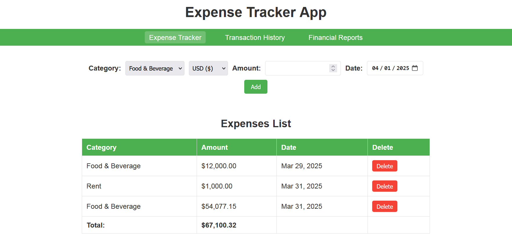

# ExpenseTrackerApp

A comprehensive financial management web application that helps users track expenses, view transaction history, and analyze spending patterns with visual reports.

## Features

- 💰 **Expense Management**

  - Add expenses with category, amount, date, and currency
  - Edit/delete existing expenses
  - Real-time total calculation

- 🌍 **Multi-Currency Support**

  - Track expenses in 5 currencies (USD, EUR, GBP, JPY, CAD)
  - Automatic conversion using exchange rate API
  - View totals in your preferred currency

- 📊 **Financial Reports**

  - Pie charts for spending by category
  - Line charts for spending trends over time
  - Monthly summaries and averages

- 📜 **Transaction History**

  - Filter by month and category
  - View all historical transactions
  - Export filtered data (future feature)

- 📱 **Responsive Design**
  - Works on desktop, tablet, and mobile
  - Adaptive layout for different screen sizes

## Technologies Used

- HTML5, CSS3 (with responsive design)
- Vanilla JavaScript (ES6+)
- Chart.js for data visualization
- Web Storage API (localStorage)

### APIs

- ExchangeRate-API (for currency conversion)
